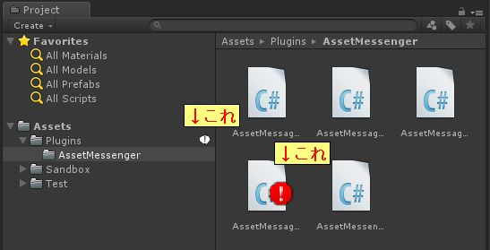
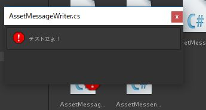
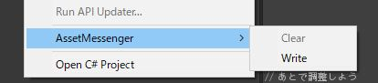

# AssetMessenger
ProjectWindowでアセットにメッセージを表示できるようになります<br>
つまり…<br>
<b>プログラマ以外はログを見ない(偏見)。ならば異常を視覚的に表示してあげようじゃないか！というアセット</b>です。<br>
警告マークが表示されてビビらせる効果抜群です。



バッジを触るとメッセージが表示されます。<br>



## こんな時に便利

ポストプロセッサと組み合わせて、異常のあるデータを表示してあげると便利。<br>
異常の原因も教えてあげられます。


# パッケージ
[パッケージファイルはこちら](./AssetMessenger.unitypackage)


## 使い方 - UIから

* アセットを`右クリック > AssetMessenger > Write`でメッセージ設定
* アセットを`右クリック > AssetMessenger > Clear`でメッセージ削除



* 一覧は 'Menu > Tools > AssetMessenger > 全メッセージ表示` から


## 使い方 - コードから

```C#
using AssetMessageService;

Object obj;
AssetMessenger.Set(obj, "これでコメント設定", MessageType.Error);
AssetMessenger.Clear(obj); // 削除

// 投稿者を指定するとそのコメントは消せなくなる
AssetMessenger.Set(obj, "これでコメント設定", MessageType.Error, "HogeHoge"); // HogeHoge以外からは消せない
AssetMessenger.Clear(obj, "HogeHoge"); // 消すときはHogeHoge指定

```
